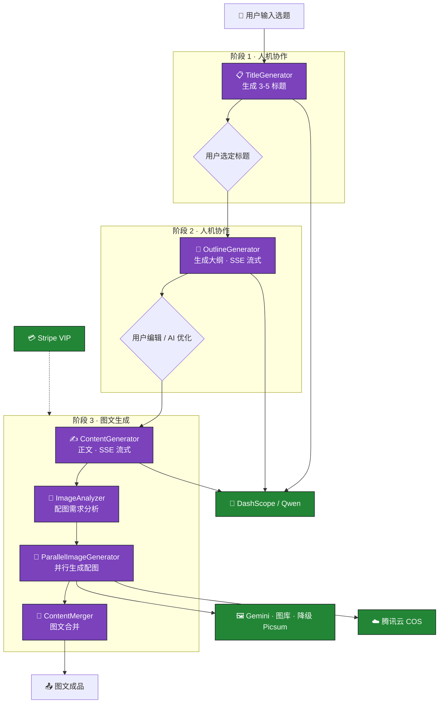

# ✍️ AI Passage Creator — 灵犀写作

<div align="center">


-FF6F00?style=for-the-badge)


**AI 驱动的内容创作平台 — StateGraph 多智能体编排 · 6 策略并行配图 · Stripe VIP 商业闭环**

</div>

---

## 🎯 一句话说清楚

> 输入一个选题，AI 自动走完 **标题策划 → 大纲设计 → 正文撰写 → 配图分析 → 并行配图 → 图文合并** 的全流程，生成可直接发表的精美文章。整个过程通过 **SSE 实时反馈**，关键节点支持**人工确认/编辑**，一键发布到你的内容平台。

---

## 🧠 多智能体协作流程



### 🤖 5 大专业 Agent + 1 合并 Agent

| Agent | 职责 | 输出 | 特色 |
|-------|------|------|------|
| **TitleGenerator** | 基于选题分析爆款规律，生成 3-5 个标题选项 | `List<TitleOption>` | 人机选择确认 |
| **OutlineGenerator** | 生成文章大纲 + 各章节要点 | `OutlineResult` | **SSE 流式**输出，用户可拖拽编辑 |
| **ContentGenerator** | 按大纲生成 Markdown 正文 | 带占位符的完整正文 | **SSE 流式**，JSON 截断自动修复 |
| **ImageAnalyzer** | 分析正文内容，为每个配图点生成策略 | `List<ImageRequirement>` | 智能匹配配图方法 |
| **ParallelImageGenerator** | 按配图策略**并行**拉取/生成图片 | `List<ImageResult>` | CompletableFuture 分组并发 |
| **ContentMerger** | 将图片替换占位符，合并为最终文章 | Markdown 成品 | |

---

## 🎨 6 策略并行配图

```
用户配图策略 → ImageRequirement 列表
    │
    ├─ Pexels 组 ────→ Pexels API 关键词搜索（全部用户可用）
    ├─ Mermaid 组 ───→ mermaid-cli 生成流程图（全部用户可用）
    ├─ Iconify 组 ───→ Iconify API 图标搜索（全部用户可用）
    ├─ 表情包 组 ───→ Bing 图片搜索结果（全部用户可用）
    │
    ├─ Nano Banana 组 → Gemini API AI 生图（✨ VIP 独占）
    └─ SVG 组 ──────→ AI 生成 SVG 概念图（✨ VIP 独占）
    │
    └─ Picsum 降级 ──→ 所有策略失败时的最终兜底
    │
    └─ 上传至 腾讯云 COS → 返回图片 URL 列表
```

---

## 💳 Stripe VIP 商业闭环

| 组件 | 实现 |
|------|------|
| **Checkout Session** | `/vip` 接口创建 Stripe Hosted Checkout |
| **Webhook 签名校验** | `StripeWebhookController` 验证 `Stripe-Signature` |
| **状态幂等** | 按 `paymentIntent.id` 去重，防止重复升级 |
| **终身 VIP** | `$199` 一次付费永久解锁 → 无限额度 + Nano Banana + SVG 高级配图 |
| **7 日退款** | Webhook `charge.refunded` 事件自动降级额度 |

---

## 📊 可观测性

### AOP Agent 执行日志

```java
@AgentExecution(agentName = "ContentGenerator", phase = 3)
public void execute(Map<String, Object> state) { ... }
```

`@AgentExecution` 注解 + `AgentExecutionAspect` 切面，自动记录每次 Agent 调用的：
- Agent 名称、阶段、输入参数、输出结果
- 执行耗时（ms）、成功/失败状态
- 持久化至 `agent_log` 表 → 管理端 ECharts 统计面板

### SSE 流式推送

`SseEmitterManager`（ConcurrentHashMap）管理每个生成任务的 SSE 连接：
- `AGENT1_COMPLETE` → `AGENT2_STREAMING` → `CONTENT_COMPLETE` → `IMAGES_COMPLETE` → `MERGE_COMPLETE`
- 心跳保活（30s）+ 按 `taskId` 精准路由

---

## 🏗️ 技术栈

| 层级 | 技术选型 |
|------|---------|
| **运行时** | Java 21 · Spring Boot 3.5.13（虚拟线程） |
| **AI 编排** | Spring AI Alibaba Graph 1.1.0（StateGraph + NodeAction） |
| **LLM** | DashScope / 通义千问（Qwen） |
| **ORM** | MyBatis-Flex 1.11.1 |
| **缓存 / Session** | Redis 7 + Spring Session Data Redis |
| **对象存储** | 腾讯云 COS |
| **文档** | Knife4j 4.4（OpenAPI 3） |
| **前端** | Vue 3.5 + TypeScript 5.8 + Ant Design Vue 4.2 + ECharts 6 |

---

## 🚀 快速启动

```bash
git clone https://github.com/1byteone/ai-passage-creator.git
cd ai-passage-creator

# 配置环境变量（LLM Key, Stripe Key, COS Key 等）
cp .env.example .env

# 一键启动（Java 后端 + MySQL + Redis + Vue 前端）
docker-compose up -d

# 访问
# 前端: http://localhost
# API 文档: http://localhost:8123/api/doc.html
```

---

## 📂 项目结构

```
ai-passage-creator/
├── src/main/java/com/example/aipassagecreator/
│   ├── agent/                  # 🧠 AI Agent 编排层
│   │   ├── agents/             #   6 个 NodeAction Agent 实现
│   │   ├── parallel/           #   ParallelImageGenerator 并行配图
│   │   ├── tools/              #   @Tool 注解工具
│   │   ├── config/             #   StateGraph 配置 + MemorySaver
│   │   ├── context/            #   ThreadLocal SSE StreamHandler
│   │   └── ArticleAgentOrchestrator.java  # StateGraph 总调度
│   ├── controller/             # 🌐 REST + SSE 控制器
│   ├── service/                # 📦 业务逻辑 + 图片策略 + Stripe
│   ├── mapper/                 # 🗄️ MyBatis-Flex 数据层
│   ├── annotation/aop/         # 📊 @AgentExecution AOP 切面
│   └── model/                  # 📄 po/dto/vo
├── frontend/                   # 🎨 Vue 3 + Ant Design 前端
└── sql/                        # 🗃️ 初始化脚本（含 agent_log 表）
```

---

## 📄 License

[MIT](LICENSE) © 1byteone
